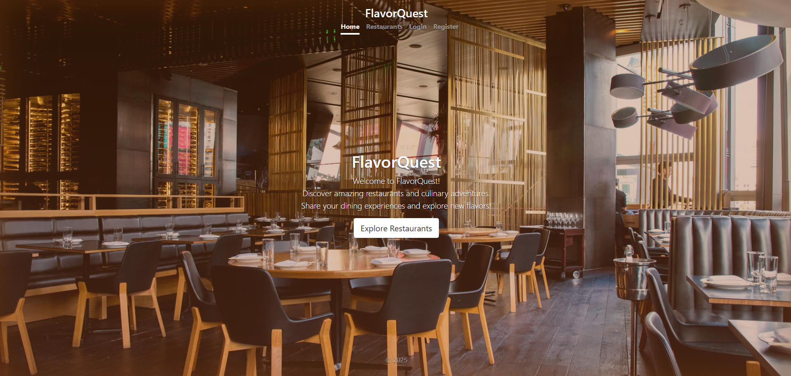
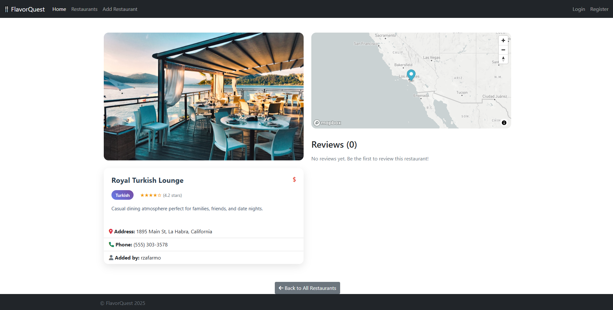

# FlavorQuest 🍴

> A full-stack restaurant discovery and rating platform that enables users to explore, add, and review amazing restaurants, creating a comprehensive culinary adventure experience.

## ✨ Features

- **🏪 Restaurant Discovery**: Browse and search restaurants by cuisine, location, and price range
- **📝 Reviews & Ratings**: Leave detailed reviews with star ratings for restaurants
- **🗺️ Interactive Maps**: Integrated Mapbox maps showing restaurant locations
- **📷 Image Uploads**: Upload and manage restaurant photos via Cloudinary
- **🔐 User Authentication**: Secure user registration, login, and session management
- **📍 Address Autocomplete**: Smart address suggestions powered by Mapbox Geocoding
- **💰 Price Range Filtering**: Find restaurants that match your budget ($, $$, $$$, $$$$)
- **📱 Responsive Design**: Modern, mobile-friendly interface

## 🚀 Tech Stack

- **Backend**: Node.js, Express.js
- **Database**: MongoDB with Mongoose ODM
- **Authentication**: Passport.js (Local Strategy)
- **File Upload**: Multer + Cloudinary
- **Maps**: Mapbox GL JS
- **Validation**: Joi with HTML sanitization
- **Styling**: Bootstrap 5, Custom CSS
- **Deployment**: Railway

## 📸 Screenshots

### Home Page

### Restaurant Discovery

### Restaurant Details & Reviews
.png)

### Add New Restaurant
.png)

---

**📅 Created in 2025** | **🔗 Live Demo**: [Your Railway URL Here]
